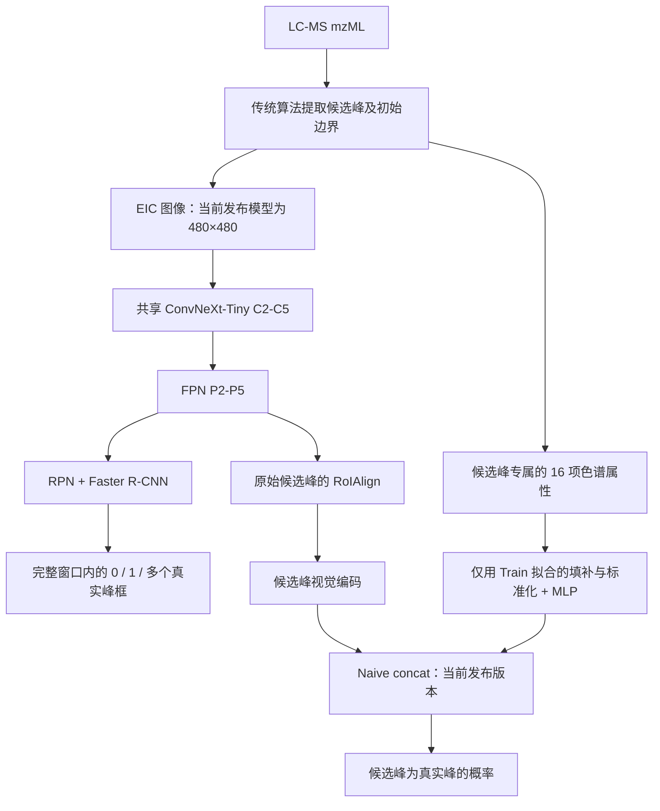

# ChromaPeak 项目结构与代码检查（2026-09-30）

项目名称采用 **ChromaPeak**，说明语为 **Joint chromatographic peak detection and candidate validation for LC-MS**，中文为“LC-MS 色谱峰联合检测与候选验证”。Chroma 对应 chromatography，Peak 直接表达研究对象。它适用于不同化合物类别的 LC-MS 数据，也能覆盖当前的多任务模型。

对外术语统一为 **Candidate（候选峰）**。`candi` 可作为内部简称，正式说明采用完整单词 Candidate。

## 实际模型结构

主模型为 `lipidbench/models/peak_multitask_rcnn.py` 中的 `PeakMultiTaskRCNN`。共享骨干只计算一次；检测分支使用完整窗口的图像特征，候选验证分支使用原始候选区域的视觉特征及其属性。候选属性没有复制到其他检测框，语义分工正确。

一个原始候选可以是假峰，同时同一 EIC 窗口中的其他位置存在真峰。因此候选分类标签与检测标签应独立；代码和测试支持这一情况。

当前发布权重采用 **16 项属性 + Naive concat**，并非默认门控融合。16 项属性依次为：

`SNR, CV, GS, TPAS, H2B, ZZ, DZZ, PCC, SKEW, DENT, DM, ENT, JAG, SYM, MOD, EDGE`

`scripts/convnext/` 中还保留整图候选分类的比较实验；它们和共享 FPN 的多任务模型不是同一结构。

## 已修复的问题

| 问题 | 原来的后果 | 本轮修改 |
| --- | --- | --- |
| EIC 导出硬编码 400×300，并忽略 YAML 图像与窗口参数 | 新导出图像与发布模型约定不一致，用户配置不生效 | 读取配置，默认及项目配置统一为 480×480 |
| `ms-dial` / `msdial` / `ms_dial` 未统一，结果目录只找 `msdial` | 命令行运行后找不到 `ms_dial` 中的结果，Excel 列名也可能不被转换 | 统一算法别名，兼容历史目录名，使用实际配置的输出目录 |
| EIC 的相对输出路径和 YAML mzML 路径依赖启动目录 | 从其他目录运行时寻找错误的文件 | 按项目根目录解析 YAML 路径，与上游 runner 保持一致 |
| 短曲线平滑采用 NumPy `same` 卷积 | 1–4 个扫描点被扩展为 5 个点，后续梯度或索引报错 | 对完整卷积居中截取，保持原始扫描点数 |
| RT 轴未检查有限性和严格递增 | 重复、倒序或 NaN RT 进入梯度计算，可能产生无效结果 | 明确拒绝无效 RT 轴，同时检查 RT hint |
| 外部 float64 候选框与 float32 图像特征混用 | RoIAlign 直接报 dtype 不匹配 | 候选框按变换后图像的 dtype 和设备转换 |
| FPN 各层允许不同 anchor 数量 | 与共享 RPN 预测头不兼容，直到前向过程才失败 | 构造时检查各层 anchor 数量一致，比例须为有限正数 |
| 配置与当前属性维数、融合方式不一致 | 模型输入不符，训练可能在前向时失败 | YAML 与 Python 默认值统一到 16 属性 + Naive concat；移除旧训练入口和属性方案 |
| 部分维护中的 RTX 工作流写死旧机器路径 | 换电脑、换盘符或在 Linux 下运行默认入口失败 | 主训练、评估、调度和 LODO 工作流按脚本位置确定项目根目录 |
| 概览文档仍宣称训练、数据集和评估尚未实现 | 对项目成熟度和结构产生误导 | 更新 README、结构说明、流程说明和研究定位 |

## 名称与兼容性

新入口为 `python -m chromapeak`。README、项目配置和 CLI 显示名称均采用 ChromaPeak。

`lipidbench/` 实现包、`PeakTruthLab/` 数据与实验目录、`seed_*` 历史接口和 `best_seed.pt` 文件名保留，避免使已有脚本、数据清单和模型引用失效。候选术语迁移可以在后续版本中引入新的接口名称，再逐步弃用旧接口。

维护中的 RTX 工作流支持 `CHROMAPEAK_PROJECT_ROOT`，也保留 `LIPIDBENCH_PROJECT_ROOT` 的兼容读取。旧训练、旧评估及属性迁移入口已移除；正式训练所需的批处理工具位于 `lipidbench/data/training_utils.py`，整图分类组件位于 `scripts/convnext/candidate_components.py`。

## 实验表述需要保持准确

Main 采用来源比例分层和重复样本组约束的 80/10/10 划分，**并非完整 mzML 互斥划分**。构建脚本的 `assign_split` 与现有划分协议都明确体现这一点。跨来源或跨域泛化应使用 LODO 结果，不应仅依据 Main 分数宣称。

现有锁定评估文件记录 Main Test 检测 F1 为 0.8928、mAP@0.50:0.95 为 0.6553，候选分类 AUROC 为 0.9885。这些是历史评估记录，本轮未重新测量，也未据此重新选择模型或阈值。

模型输出的是图像坐标中的峰框。EIC 提取、RT 边界细化和积分已有独立工具，但自动串联“检测框 → 原始 RT → 每个预测峰重算属性与面积”的完整二阶段定量流程仍需集成验证。论文中应区分检测能力与下游定量能力。

## 验证结果

- 修改前现有测试：37 项通过。
- 新增的第一批 14 个回归用例在修改前全部失败，修改后全部通过。
- 清理后的完整测试：`python -m pytest -q --tb=short`，62 项通过。
- 维护中的训练/评估入口可从其他工作目录识别本项目；候选分类的四种比较模式均支持当前 16 项属性。
- 提取候选分类公共组件后，四种模式均通过严格参数加载，输出与迁移前完全一致；合并后的属性计算在 1、2、7、51 个扫描点曲线上与原 16 属性计算完全一致（含缺失值）。
- 新入口：`python -m chromapeak --help` 正常。
- 现有 `best_detection.pt` 与 `best_seed.pt` 均通过 `strict=True` 状态字典加载，全部参数键匹配；均确认是 16 属性和 Naive concat。

本轮检查覆盖核心模型、数据接口、导出流程和维护中的训练入口，未执行完整 GPU 训练，也未重跑已锁定的 Test/heldout 评估。
