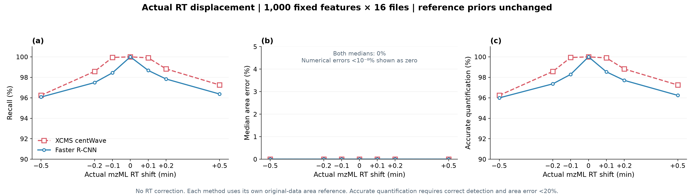
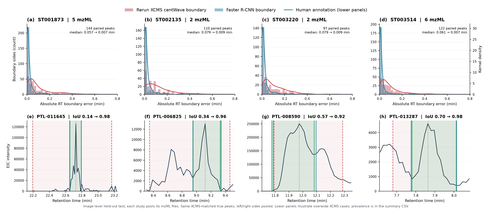

# 保留时间漂移与色谱峰边界定位：论文方法与结果草稿

本稿包含两项评价：16 个 mzML、1000 个共同 feature 的实际保留时间漂移实验，以及四个 study、473 个配对峰实例的人工边界比较。两部分使用既有 **image-only Faster R-CNN** 模型及其锁定结果；这些数值尚未用于评价当前默认的 16 属性 naive-concat 模型。图 R1、图 R2 为稿件中的临时编号。

## 1. 方法

### 1.1 实际保留时间漂移实验

为评价目标峰偏离预期保留时间后的检出和定量稳定性，从 ST002233/HZV029 的 CommercialQstdPooled 样本中选取 16 个可分析 mzML 文件。文件选择依据既有 XCMS 表中无歧义共同 feature 的覆盖情况。共有 2341 个 feature 在全部 16 个文件中对应唯一原始 XCMS 峰；排除原始 apex RT 小于 0.6 min 的目标后，得到 1967 个 baseline 候选。在未施加漂移的原始数据上分别运行 XCMS 和模型，经联合检出及 baseline 峰身份 QC 后，1485 个 feature 满足全部 16 个样本中的纳入条件。从中按 baseline 模型置信度选取 1000 个 feature，置信度相同时优先考虑边界一致性，未进行强度、SNR 或峰宽分层。

联合纳入条件要求双方在全部 16 个文件中均输出有效目标峰，模型原始 EIC apex 与原始 XCMS 目标及本轮选中 XCMS apex 的差异不超过 10 s，双方边界包含 baseline 目标 apex，且积分面积为有限正值。为减少共洗脱质量峰混淆，追加检查本轮 baseline XCMS 峰与同文件原始 XCMS 峰的 m/z 差异不超过 0.2 ppm、面积差异不超过 1%。这组目标构成两算法共同确认的操作性正参考队列，尚不属于独立人工或化学标准确认的金标准。

固定 feature 表中的 m/z 和预期 RT 分别取 16 个原始文件对应 XCMS m/z 与未校正 apex RT 的中位数。在每个文件的原始 mzML 上施加七档恒定实际时间平移：

$$
\Delta RT\in\{-0.5,-0.2,-0.1,0,+0.1,+0.2,+0.5\}\ {\rm min}.
$$

仅修改谱图 scan start time 和色谱时间数组，保留 m/z、强度、扫描间隔及峰形，不重采样或裁切信号。参考表的 m/z 和 RT 在所有条件下均保持原值。每个 feature 在同一套 16 个文件中测试全部七档漂移，得到 16000 个 feature×file 目标和 224000 条两方法的预测记录。后者是相同目标的重复测量，不代表 224000 个独立真实峰。逐文件完整性审计验证了时间平移和非时间二进制数据的不变性。

传统流程采用 XCMS 4.10.1 的全谱 centWave 检测，随后根据固定 feature 表匹配目标。检测参数为 ppm=5、peakwidth=5–50 s、noise=3000、snthresh=5、prefilter=(3,3000)、mzdiff=0.001、mzCenterFun=wMean、integrate=1、fitgauss=FALSE。匹配候选的 m/z 容差为 10 ppm，apex RT 窗口为固定参考 RT±1 min。多个候选时选取 apex 距固定预期 RT 最近者，基本同距时优先取 S/N 较高者。直接使用 centWave 原生边界与积分面积 into，本实验不追加传统边界修正，不进行 RT correction、alignment、grouping 或 gap filling。

模型沿用同一 image-only Faster R-CNN checkpoint、480×480 EIC 图像和 confidence≥0.5 门槛。EIC 使用实际漂移后的 mzML，以固定参考 m/z、10 ppm 容差及现有 nearest-centroid 规则提取；输入时间窗始终为固定参考 RT±1 min。模型输出框内的原始 EIC 最高点用于确定 predicted apex，多个有效候选时选取 apex 距固定预期 RT 最近者，基本同距时以 confidence 优先。面积复用项目既有局部 20% 分位数扣背景与梯形积分代码。不同漂移条件下不重新训练或调整参数。已知漂移量、逐文件 baseline apex、边界和面积仅用于预测完成后的评价。

正确检出要求选中候选的 apex 距该文件原始目标 apex+$\Delta RT$ 不超过 10 s，且预测边界包含该预期 apex。无候选、选错邻峰或边界未覆盖预期 apex 均记为失败。Recall 为正确检出的目标数除以全部目标数。面积稳定性以各方法在同文件原始数据上的自身 baseline 面积为参考：

$$
E_A=\frac{|A_{\Delta RT}-A_0|}{A_0}\times100\%.
$$

准确量化率定义为“正确检出且 $E_A<20\%$”的目标数除以全部目标数。面积误差的 median、mean 和 IQR 在所有有有效选中峰的目标上计算，包含选错峰；无候选的误差保留为缺失值，并在 Recall 和准确量化率中计为失败。另保存仅正确检出目标的面积误差统计。两方法面积均采用 intensity×seconds，但 EIC 提取、背景估计和积分规则不同，因此本实验比较相对自身 baseline 的稳定性。

### 1.2 人工标注峰边界的配对比较

从此前完成逐图人工复核的数据中选取 ST001873、ST002135、ST003220 和 ST003514 四个 study，分别汇总该图像数据子集中对应的 5、2、2 和 6 个 mzML，共 15 个文件。使用既有锁定图像测试集的已标注正候选，每张图保留与原始候选对应的人工真实峰，形成 632 个待核对峰实例。模型结果取自既有锁定 image-only 测试输出，未根据此次边界图重新训练或调参。

对 15 个 mzML 逐文件重新运行 centWave，使用与上述检测参数一致的项目常规参数，不进行 gap filling。以原始候选的 m/z 和 RT 匹配新产生的 XCMS 峰，候选须满足 m/z 差异≤10 ppm、apex RT 差异≤0.3 min；存在多个候选时，最小化 $|\Delta RT|/0.1+|\Delta m/z|_{\rm ppm}/5$。这一 XCMS 匹配过程不使用人工边界或模型边界。

模型框与人工峰的对应关系使用既有锁定测试评价中的二维框 IoU≥0.5 匹配。匹配属于预测后的评价步骤，不参与模型推理。通过原始候选框和 RT 坐标进行像素到 RT 的线性换算，并要求人工框换算后的左右 RT 与既有人工 RT 标注的最大差异≤0.005 min。在 632 个候选中，511 个匹配 XCMS、593 个匹配模型，其中 485 个同时匹配双方，进一步通过 RT 映射校验后保留 473 个配对峰实例。四个 study 分别贡献 144、110、97 和 122 个。

以人工左右边界作为参考，计算预测左、右边界的绝对 RT 误差以及 RT 方向的一维区间 IoU：

$$
E_L=|L_{\rm pred}-L_{\rm human}|,\quad
E_R=|R_{\rm pred}-R_{\rm human}|,\quad
IoU_{\rm RT}=\frac{|[L_{\rm pred},R_{\rm pred}]\cap[L_{\rm human},R_{\rm human}]|}
{|[L_{\rm pred},R_{\rm pred}]\cup[L_{\rm human},R_{\rm human}]|}.
$$

每个 study 的误差分布合并左右两侧，因此 473 个配对峰对应每方法 946 个边界侧误差值。报告合并侧误差的中位数、均值、每峰 IoU 中位数，以及预测宽度与人工宽度之比。左右两侧和同一 mzML 内的峰存在相关性，本轮仅作描述性统计，不将这些边界侧视为独立样本开展显著性检验。

## 2. 结果

### 2.1 恒定实际 RT 漂移下的目标检出与定量稳定性

原始未漂移条件下，两方法均检出全部 16000 个目标，Recall 和准确量化率为 100%。这一 baseline 表现由联合纳入标准和自身面积对照的定义共同决定，用于确认后续实验的起点与数据流程，不能据此单独推断所有未筛选 feature 的检出率或绝对定量准确性。

施加非零实际 RT 漂移后，XCMS Recall 为 96.24%–99.94%，模型为 96.08%–98.68%；XCMS 准确量化率为 96.24%–99.94%，模型为 95.99%–98.54%。在 −0.5 min 条件下，两方法 Recall 分别为 96.24% 和 96.08%；在 +0.5 min 条件下分别为 97.26% 和 96.37%（表 R1，图 R1）。两方法在本轮范围内均保持较高的检出和面积稳定性，XCMS 在六个非零漂移条件的最终 Recall 和准确量化率均略高于模型。

**表 R1. 每档实际 RT 漂移的总体 Recall 与准确量化率。**

| ΔRT (min) | XCMS Recall | 模型 Recall | XCMS 准确量化率 | 模型准确量化率 |
| --- | --- | --- | --- | --- |
| -0.5 | 96.24% | 96.08% | 96.24% | 95.99% |
| -0.2 | 98.58% | 97.49% | 98.58% | 97.36% |
| -0.1 | 99.94% | 98.44% | 99.94% | 98.29% |
| 0 | 100.00% | 100.00% | 100.00% | 100.00% |
| +0.1 | 99.91% | 98.68% | 99.90% | 98.54% |
| +0.2 | 98.83% | 97.84% | 98.82% | 97.71% |
| +0.5 | 97.26% | 96.37% | 97.25% | 96.24% |

所有漂移条件下，两方法面积相对误差的中位数均接近零。非零漂移下，XCMS 的平均面积误差为 0.05%–2.72%，模型为 1.11%–3.16%（表 R2）。中位数反映多数目标保持了相同峰身份与积分，而均值反映少数选错峰或面积变化产生的长尾误差；因此近零中位数不表示所有峰的定量均正确。

**表 R2. 有有效选中峰目标的面积误差统计（单位：%）。**

| ΔRT (min) | 中位数 XCMS / 模型 | XCMS 均值 | 模型均值 | XCMS IQR | 模型 IQR |
| --- | --- | --- | --- | --- | --- |
| -0.5 | ≈0 / ≈0 | 2.715 | 3.052 | ≈0 | 0.0218 |
| -0.2 | ≈0 / ≈0 | 1.008 | 2.161 | ≈0 | 0.0121 |
| -0.1 | ≈0 / ≈0 | 0.050 | 1.355 | ≈0 | 0.0110 |
| 0 | ≈0 / ≈0 | 0.000 | 0.000 | ≈0 | ≈0 |
| +0.1 | ≈0 / ≈0 | 0.095 | 1.113 | ≈0 | 0.0151 |
| +0.2 | ≈0 / ≈0 | 1.079 | 1.958 | ≈0 | 0.0108 |
| +0.5 | ≈0 / ≈0 | 2.220 | 3.156 | ≈0 | 0.0204 |

“≈0”表示小于 $10^{-8}\%$；未检出目标不进入面积误差分布，但在表 R1 的准确量化率分母中保留。

完整 XCMS 原生峰表在全部 96 个非零 file×shift 条件下均可与 baseline 逐行对应，原生峰 RT 平移误差最大为 $2.84\times10^{-14}$ s，原生面积相对变化最大为 $1.49\times10^{-11}\%$。候选阶段的目标检出率为 XCMS 100%、模型 99.46%–99.77%，高于两方法最终选中目标的 Recall。非零漂移记录中，XCMS 的 1479 条和模型的 2078 条失败属于“输出中存在正确目标候选，但最近 prior 规则选中了其他峰”。这些是重复漂移条件下的失败记录数，不能作为独立错误 feature 数。

以上结果表明，恒定平移保留了扫描间隔和峰形，在目标仍处于 ±1 min 查找窗口的条件下，centWave 原生检测及积分保持稳定；性能下降主要与固定预期 RT 下的邻峰选择有关。当前数据未显示模型相对于该 XCMS 流程的实际 RT 漂移优势。本轮七个点未出现需要进一步定位的陡峭性能转折，因此暂未增加 ±0.3 和 ±0.4 min。

**图 R1. 实际保留时间平移对目标检出和定量稳定性的影响。** 1000 个联合 baseline feature 在同一套 16 个 mzML 中分别测试七档实际 RT 平移，每方法每档包含 16000 个目标。(a) 最终选中峰的 Recall；(b) 相对各方法自身原始 baseline 的面积误差中位数；(c) 正确检出且面积相对误差严格小于 20% 的准确量化率。固定 m/z/RT prior 不随平移改变，无 RT 校正、重训练或漂移专用调参。小于 $10^{-8}\%$ 的数值误差在面板 (b) 中显示为零，原始数值保留在 CSV 中。Baseline 的 100% 与零误差受队列构造及自身对照定义影响。

### 2.2 已匹配真实峰的边界定位精度

在 473 个配对峰中，重新运行 XCMS 的合并左右边界绝对误差中位数为 0.0657 min（3.94 s），模型为 0.00760 min（0.456 s），描述性降幅约 88.4%。两方法的平均侧误差分别为 0.1131 和 0.0210 min；每峰一维 RT boundary IoU 中位数分别为 0.567 和 0.937。四个 study 均呈现模型侧误差较小、IoU 较高的趋势（表 R3，图 R2）。这支持模型在本次已匹配队列中具有较好的边界定位一致性。

**表 R3. 473 个共同匹配峰相对人工边界的定位结果。**

| Study | mzML 数 | 配对峰数 | XCMS 侧误差中位数 (min) | 模型侧误差中位数 (min) | XCMS IoU 中位数 | 模型 IoU 中位数 | XCMS 比人工更宽 |
| --- | --- | --- | --- | --- | --- | --- | --- |
| 总体 | 15 | 473 | 0.0657 | 0.00760 | 0.567 | 0.937 | 23.7% |
| ST001873 | 5 | 144 | 0.0572 | 0.00672 | 0.548 | 0.929 | 29.9% |
| ST002135 | 2 | 110 | 0.0787 | 0.00924 | 0.699 | 0.950 | 52.7% |
| ST003220 | 2 | 97 | 0.0794 | 0.00938 | 0.517 | 0.937 | 4.1% |
| ST003514 | 6 | 122 | 0.0609 | 0.00670 | 0.535 | 0.934 | 5.7% |

XCMS 相对人工标注的峰宽比中位数为 0.696，模型为 0.996。XCMS 比人工边界更宽的比例在四个 study 中分别为 29.9%、52.7%、4.1% 和 5.7%，合计 23.7%；尤其在 ST003220 和 ST003514 中，XCMS 边界偏窄更常见。因此本结果支持“XCMS 边界与人工标注存在较大差异”，不能概括为“XCMS 边界普遍过宽”。图 R2 下排特意选用四个存在过宽边界的实例，展示模型框与人工边界的对应关系；这些例子的选择不改变上排分布和总体统计。

**图 R2. 重新运行 XCMS 与 Faster R-CNN 的人工参考边界比较。** (a–d) 分别对应 ST001873、ST002135、ST003220 和 ST003514，汇总其在该图像数据子集中对应的全部 mzML；配对峰数依次为 144、110、97、122。直方图为左右边界绝对 RT 误差的计数，每峰贡献两个侧误差；曲线为核密度估计，红色为 XCMS，蓝色为模型。各面板密度轴独立缩放，原图仅在最右面板显示其刻度，不比较跨面板密度曲线高度。展示范围为 0–0.8 min，XCMS 的 7 个超出该范围的侧误差仍计入全部统计及 CSV。(e–h) 每个 study 各展示一个过宽 XCMS 实例：原始 EIC 为深色曲线，XCMS 边界为红色虚线，人工标注为绿色，模型边界为蓝色；灰色点线表示人工 apex。面板内 IoU 数值为 XCMS→模型的一维 RT IoU。下排实例用于说明边界差异，其发生率以表 R3 为准。

本队列要求已有模型匹配框，且模型匹配本身使用二维 IoU≥0.5，因此属于条件性的边界精度比较。473 个模型峰的 RT IoU 均≥0.5 受到纳入条件影响，不能作为完整 632 个峰的独立 100% Recovery 或 Recall 结论。图像级测试划分也不等于整个 study 留出；当前结果尚不能单独证明跨 study 泛化。

## 3. 讨论与评价范围

两个实验分别评价固定预期 RT 下的目标查找/量化稳定性，以及已匹配真实峰的边界定位。模型在人工参考配对队列中呈现较小的边界误差，但这项优势未在本轮恒定实际 RT 平移实验中转化为更高的最终 Recall 或准确量化率。恒定平移保留峰形和相对时间结构，原生 centWave 检测及积分的平移不变性与当前结果一致；固定 prior 附近出现其他候选峰时，双方使用的最近 apex 规则均可能改变最终峰身份。

1000-feature 队列按模型 baseline 置信度筛选，且要求全部 16 文件由两方法共同检出；473-峰队列则要求双方已有匹配结果。两者均存在条件选择，分别限制了结果向未筛选 feature 和漏检峰的推广。面积评价使用各方法自身 baseline，仅反映扰动后的稳定性，尚不能评价绝对浓度准确性。所有预测记录、失败案例、参考冻结历史及纳入规则均保留以供复核。本轮不计算 FDR，也未开展以 mzML 或 study 为独立单位的推断性检验。

## 4. 补充结果：传统边界修正规则复核

对同一批 473 个原始 EIC 重放传统修正算法，GitHub 更新前后的核心算法在这批正常输入上的 apex/边界输出完全一致。未限制扩展的核心修正得到的侧误差中位数为 0.4702 min、IoU 中位数为 0.240、峰宽比中位数为 4.163，提示其在该队列上存在明显过度扩展。加入既有“最多向外扩展一个 MS1 扫描间隔”的 guard 后，侧误差中位数为 0.0574 min、IoU 中位数为 0.620，但仍有 17 个区间排除了核心算法选中的 apex，需要复核或剔除。上述 guard 统计包含全部 473 个区间，未事后移除这 17 个失败来提高指标。

**表 R4. 同一配对队列的边界规则复核。**

| 规则 | 峰数 | 侧误差中位数 (min) | IoU 中位数 | 宽度比中位数 | Guard QC 失败 |
| --- | --- | --- | --- | --- | --- |
| 原生 XCMS | 473 | 0.06573 | 0.567 | 0.696 | — |
| 未限制扩展的传统核心 | 473 | 0.47021 | 0.240 | 4.163 | — |
| 传统核心 + 一个扫描间隔 guard | 473 | 0.05739 | 0.620 | 0.786 | 17 |
| 既有锁定模型 | 473 | 0.00760 | 0.937 | 0.996 | — |

“—”表示该方法未启用 guard，因此这项 QC 不适用。

这项复核支持在具有可靠上游边界时使用带 guard 的传统修正，并检查 QC 标志；不建立其在所有数据上的最优性。它未改动图 R1 的原生 XCMS 边界或面积，也未改变图 R2 已锁定的模型预测。

## 数据、图件与复核说明

- [表 R1–R2 的原始总体汇总](summary_by_method_shift.csv)；[逐文件汇总](summary_by_file_method_shift.csv)；[候选阶段诊断](pipeline_stage_diagnostics.csv)。
- [表 R3：473 个峰的总体及分 study 汇总](boundary_473_summary.csv)；[完整配对表](paired_rerun_xcms_vs_model.csv)；[632 个候选的纳入审计](boundary_632_eligibility.csv)。
- [表 R4：传统边界规则汇总](boundary_policy_summary.csv)；[边界规则范围说明](boundary_policy_audit.json)。
- 图 R1：[PNG](figures/figure_R1_actual_rt_shift.png)、[PDF](figures/figure_R1_actual_rt_shift.pdf)；图 R2：[PNG](figures/figure_R2_boundary_473.png)、[PDF](figures/figure_R2_boundary_473.pdf)。图件沿用已完成实验的输出，未改变预测和数据。
- [图件及数据来源 SHA-256](paper_assets_manifest.json)；[论文包数据一致性复核](paper_results_audit.json)。
- [完整逐峰结果与历史记录 Release](https://github.com/yzzx02/LipidBench/releases/tag/chromapeak-rt-validation-20260930)：包含 224000 条 RT 结果、双方原始候选与日志、baseline 参考和冻结历史，以及四-study 的原始 XCMS 表与历史脚本。Release 归档不含图件，本页两张主图已单独纳入 Git 仓库。

**冻结历史说明。** 初始 1000 个目标冻结后，baseline 身份检查发现两个共洗脱质量峰混淆，用 baseline 排名下一位的两个 feature 替换。保留的 998 个 feature 参考值未变，新增两个目标的参考在其各自非零模型推理及 XCMS 目标匹配前冻结；相关 XCMS 全谱检测表此前已生成。替换未依据非零漂移结果，Recall/准确量化率的最大变化为 0.04375 个百分点。不能表述为最终 1000-feature 合集在所有非零运行开始前一次性冻结；复现流程已把该项 baseline QC 前移。[敏感性结果](baseline_mass_qc_cohort_sensitivity.csv)保留具体影响。
